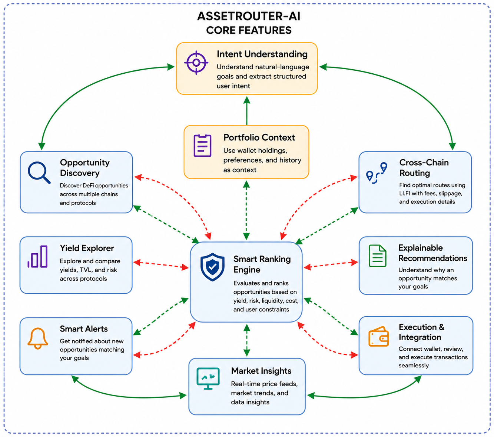
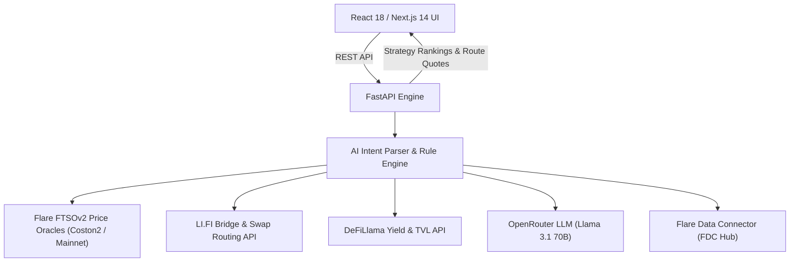

# 🚀 AssetRouter

**Live demo:** [flare-asset-management-lemon.vercel.app](https://flare-asset-management-lemon.vercel.app/)

> Non-custodial Intent Router for Tokenized Assets & Cross-Chain Yields — Powered by Flare FTSOv2 Decentralized Oracles, Flare FAssets (FXRP), LI.FI Liquidity Aggregation, and DeFiLlama Analytics.

---

## 📖 Overview

**AssetRouter** translates complex, natural language financial goals (e.g. *"I have 500 USDC on Base and want low risk yield on Flare"*) into verified multi-chain execution paths.

Rather than relying on static headline APYs or fragmented DEX interfaces, AssetRouter:
1. **Parses Intent**: LLM reasoning extracts goal parameters (target APY, risk tolerance, asset, preferred chain).
2. **Attests Market Values**: Real-time decentralized price feeds via **Flare FTSOv2** ensure pricing accuracy and collateral valuation safety.
3. **Discovers & Ranks Opportunities**: Evaluates liquidity depth from **DeFiLlama** and cross-chain bridge routes from **LI.FI**.
4. **Executes Seamlessly**: Connects EVM wallets and non-EVM assets (XRP → FXRP via Flare FAssets) to route liquidity with one click.

---

## ✨ Core Features



---

## 🛠 Modules

| Module | Purpose |
|---|---|
| **AI Intent Router** | Translates natural language financial goals into deterministic, ranked execution strategies. |
| **Flare FTSOv2 Oracles** | Sub-second Category-1 decentralized price feed attestation (`FLR/USD`, `BTC/USD`, `ETH/USD`, `XRP/USD`, etc.). |
| **Flare FAssets Engine** | Non-custodial minting and liquid staking assistant for non-EVM assets (XRP → Coston2 FXRP). |
| **LI.FI Liquidity Router** | Cross-chain DEX and bridge liquidity aggregation across Ethereum, Flare, Arbitrum, Avalanche, Polygon, and Base. |
| **Smart Opportunity Alerts** | Continuous background yield monitoring comparing active wallet holdings against live market opportunities. |
| **FDC Attestation Verifier** | Real-time Flare Data Connector voting round and DA Layer Merkle proof verification. |

---

## 🏗 Architecture



### AI Architecture


### User Flow


---

## 💻 Tech Stack

- **Frontend**: Next.js 14 (App Router), React 18, TypeScript, TailwindCSS, Plus Jakarta Sans & Figtree typography, WebGL Globe.
- **Backend**: Python 3.11+, FastAPI, Uvicorn, Web3.py.
- **Oracles & Infrastructure**: Flare FTSOv2 Smart Contracts (`0x1000000000000000000000000000000000000003`), Flare FAssets (FXRP), Flare Data Connector.
- **Integrations**: LI.FI SDK (Bridge & Swap), DeFiLlama API (Yields & TVL), OpenRouter API (LLM Inference).
- **Wallet Support**: MetaMask, Web3 EVM Providers, Demo Wallet Simulator.

---

## ⚙️ Setup & Installation

### Prerequisites
- **Node.js**: v18.0.0 or higher
- **Python**: v3.11 or higher

### Quick Start (One-Shot Script)

Run the automated Arch/Linux launch script:
```bash
./start.sh
```

### Manual Setup

#### 1. Backend (FastAPI)
```bash
cd backend
python3 -m venv .venv
source .venv/bin/activate
pip install -r requirements.txt
cp .env.example .env   # Configure OPENROUTER_API_KEY if available
python3 -m uvicorn app.main:app --reload --port 8000
```

Verify backend health:
```bash
curl http://localhost:8000/health
```

#### 2. Frontend (Next.js)
```bash
cd frontend
npm install
npm run dev
```

Open `http://localhost:3000` in your browser.

---

## 🌐 Environment Variables

### Backend (`backend/.env`)
```env
OPENROUTER_API_KEY=your_openrouter_key
COSTON2_RPC_URL=https://coston2-api.flare.network/ext/C/rpc
LIFI_API_URL=https://li.quest/v1
CORS_ORIGINS=http://localhost:3000,https://asset-router.vercel.app
```

### Frontend (`frontend/.env.local`)
```env
NEXT_PUBLIC_API_BASE=http://localhost:8000/api
```

---

## 📄 License & Attribution

Built for the Flare Network Hackathon. Powered by Flare FTSOv2, Flare FAssets, LI.FI, and DeFiLlama.
